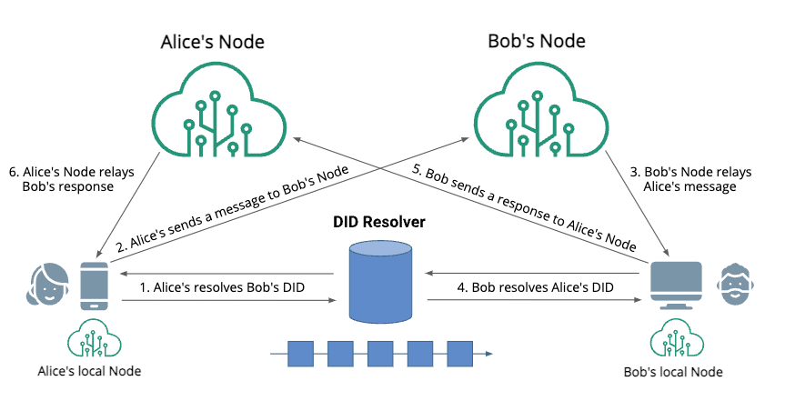
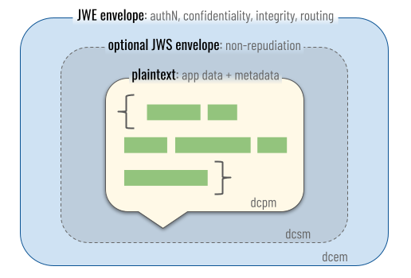
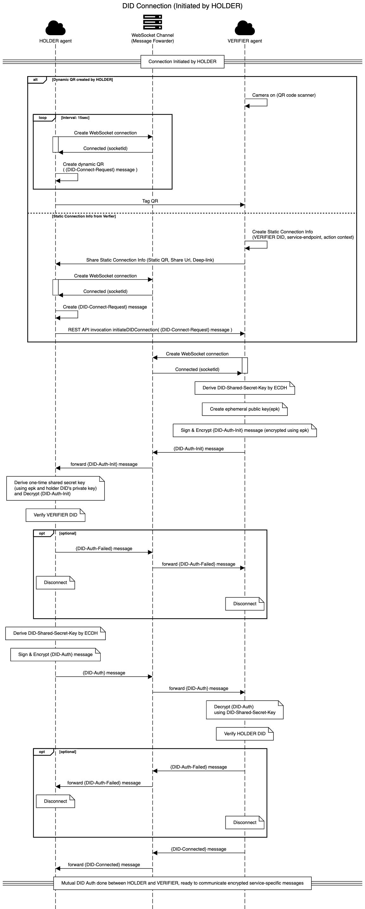
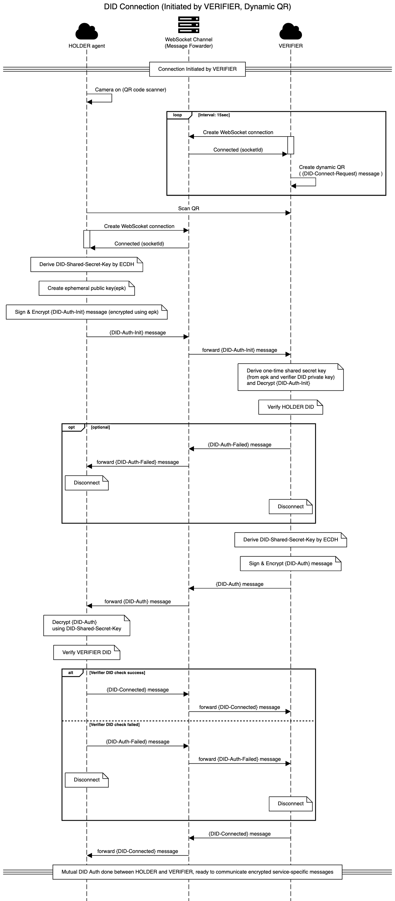
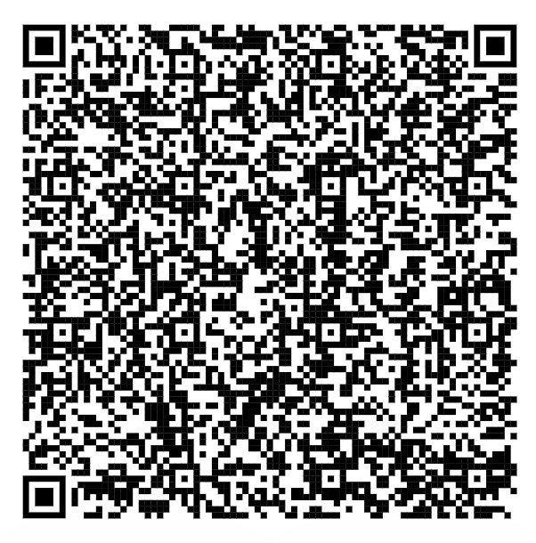
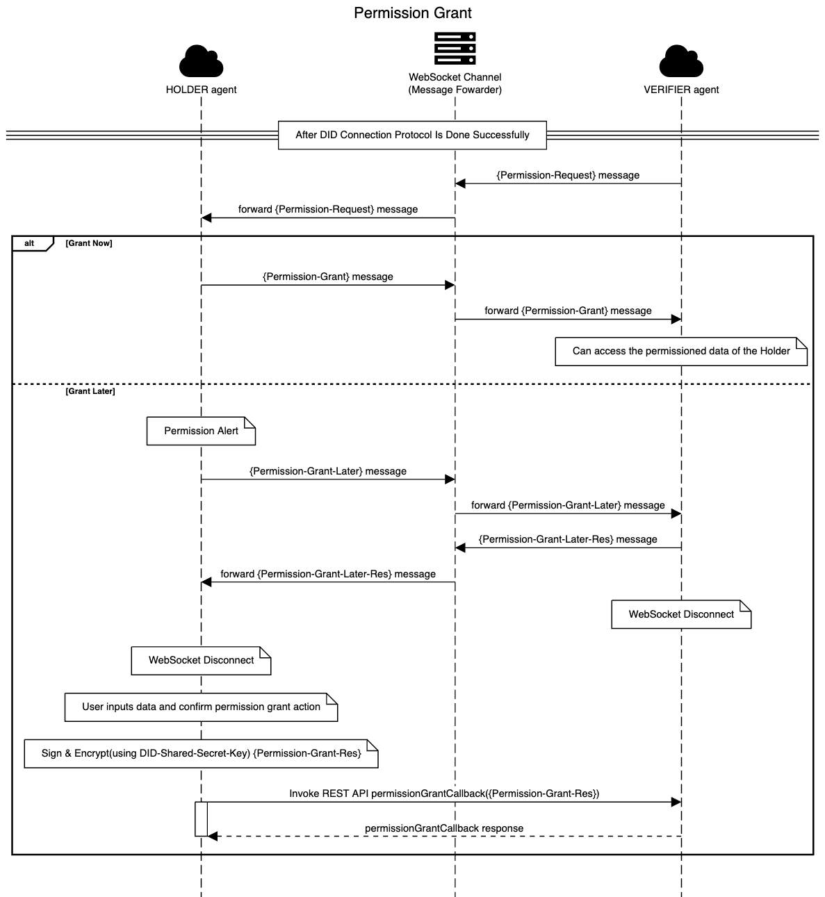

# InfraDID Agent Communication Protocol V0.5

# Change log

-   230413 evan - submit-VC Message : Reject 요건 반영(status 추가)
-   230426 evan - deprecate submit-VC Protocol → add VP Protocol (변경 초안 작성)
-   230428 evan - 명칭, 설명 수정
    -   VP-Req Message
        -   Schema → VC-Type 으로 수정 & 설명 보강 (jsonld 용어랑 혼동. == vc defined jsonld IRI)
    -   Reject-VP(-Res) → Reject-ReqVP(-Res)

# 0. Reference

-   Infra DID : [https://github.com/InfraBlockchain/infra-did-method-specs/blob/main/docs/Infra-DID-method-spec.md](https://github.com/InfraBlockchain/infra-did-method-specs/blob/main/docs/Infra-DID-method-spec.md)
-   Decentralized Identifiers (DIDs) : [https://www.w3.org/TR/did-core/](https://www.w3.org/TR/did-core/)
-   Verifiable Credentials Data Model : [https://www.w3.org/TR/vc-data-model/](https://www.w3.org/TR/vc-data-model/)
-   DIDComm Messaging : [https://identity.foundation/didcomm-messaging/spec/](https://identity.foundation/didcomm-messaging/spec/)
-   Decentralized Web Node (DWN) : [https://identity.foundation/decentralized-web-node/spec/](https://identity.foundation/decentralized-web-node/spec/)
-   JSON Web Token (JWT) : [https://www.rfc-editor.org/rfc/rfc7519](https://www.rfc-editor.org/rfc/rfc7519)
-   JSON Web Algorithm (JWA) : [https://www.rfc-editor.org/rfc/rfc7518](https://www.rfc-editor.org/rfc/rfc7518)
-   JSON Web Signature (JWS) : [https://www.rfc-editor.org/rfc/rfc7515](https://www.rfc-editor.org/rfc/rfc7515)
-   JSON Web Encryption (JWE) : [https://www.rfc-editor.org/rfc/rfc7516](https://www.rfc-editor.org/rfc/rfc7516)
-   JSON Web Key (JWK) : [https://www.rfc-editor.org/rfc/rfc7517](https://www.rfc-editor.org/rfc/rfc7517)
-   JSON Web Message (JWM) : [https://datatracker.ietf.org/doc/html/draft-looker-jwm-01](https://datatracker.ietf.org/doc/html/draft-looker-jwm-01)
-   Sequence diagram: [https://sequencediagram.org/](https://sequencediagram.org/)

## DID Agents (Decentralized Web Node) Topology



## JWM message structure

```json
{
	"id": "1234567890",
	"type": "<message-type>",
	"from": "did:example:alice",
	"to": ["did:example:bob"],
	"ack": ["cd7fc3c9-6fd1-4793-b5cf-4cbfc708e574"],
	"created_time": 1516269022,
	"expires_time": 1516385931,
	"body": {
		"message_type_specific_attribute": "and its value",
		"another_attribute": "and its value"
	}
}
```

# 1. DID Connection Protocol

-   Holder-Verifier DID 간 비동기 양방향 비밀 통신 채널 생성 및 상호 DID 인증 위한 프로토콜
-   Diffie-Hellman 알고리즘을 통한 키 교환 과정을 포함, DID Connection이 이루어진 이후 DID간 메세지들은 공유된 비밀키(DID-Shared-Secret-Key)를 사용하여 암호화 통신함
    -   DID-Shared-Secret-Key
        -   Holder : KeyDerivation(KeyAgreement(public-key of Verifier DID, private-key of Holder DID))
        -   Verifier : KeyDerivation(KeyAgreement(public-key of Holder DID, private-key of Verifier DID))
-   Holder, Verifier 간 통신채널을 제공하는 Websocket Channel (Message Forwarder)은 어떤 DID가 통신 중인지 DID간 어떤 메세지를 전송하는지 원천적으로 알수 없도록 한다.
-   이후 서비스 로직(VP, Permission Grant 등)은 DID Connection 단계를 완료한 후 비밀 통신 웹소켓 채널을 통해 진행함

-   Holder Verifier간 WebSocket channel이 연결된 후에는 DIDComm 메세지 표준에 따라 JWE(JWS(JWM))) 포멧으로 encoding된 메세지를 통해 상호간 통신을 수행한다.



DID Connection이 이루어지는 경우는 아래와 같은 케이스들로 구분됨

-   **Holder가 DID Connection을 시작**
    -   **Holder 앱에서 Dynamic QR (Holder DID, Websocket Channel, Action Context 정보 포함) 을 생성하고 Verifier 앱에서 스캔**
        -   Verifier앱(mobile DID agent)이 직접 Connection 과정을 처리할 수도 있고, Verifier앱과 연결되 Cloud Agent를 이용하여 Connection 과정을 처리할 수 있음
    -   **Verifier가 생성한 Static Connection Information을 Holder앱에서 받아 DID Connection을 시작하는 경우**
        -   Static Connection Info는 Verifier DID, Service Endpoint, Action Context 정보를 포함해야 하며, Static QR 코드, Share URL, Deep Link 등을 통해서 Holder 앱으로 전달될 수 있음
        -   Holder 앱에서 Verifier Cloud Agent의 initiateDIDConnection REST API를 호출하여 DID Connection 시작
-   **Verifier가 DID Connection을 시작**
    -   Verifier 앱/웹에서 Dynamic QR을 생성하고 Holder 앱에서 스캔



-   UML

    ```json
    title DID Connection (Initiated by HOLDER)

    fontawesome f0c2 "HOLDER agent" as ha
    fontawesome f233 "WebSocket Channel\n(Message Fowarder)" as ws
    fontawesome f0c2 "VERIFIER agent" as va

    ==Connection Initiated by HOLDER==

    alt Dynamic QR created by HOLDER

    va->va: Camera on (QR code scanner)
    loop Interval: 15sec
    ha->ws: Create WebSocket connection
    activate ha
    ws->ha: Connected (socketId)
    deactivate ha
    ha->ha:Create dynamic QR \n( {DID-Connect-Request} message )
    end
    ha->va:Tag QR

    else Static Connection Info from Verfier

    va->va: Create Static Connection Info\n(VERIFIER DID, service-endpoint, action context)
    va->ha: Share Static Connection Info (Static QR, Share Url, Deep-link)
    ha->ws: Create WebSocket connection
    activate ha
    ws->ha: Connected (socketId)
    deactivate ha
    ha->ha:Create {DID-Connect-Request} message
    ha->va: REST API invocation initiateDIDConnection( {DID-Connect-Request} message )

    end

    va->ws: Create WebSocket connection
    activate va
    ws->va:Connected (socketId)
    deactivate va
    note over va: Derive DID-Shared-Secret-Key by ECDH
    note over va: Create ephemeral public key(epk)
    note over va: Sign & Encrypt {DID-Auth-Init} message (encrypted using epk)
    va->ws: {DID-Auth-Init} message
    ws->ha: forward {DID-Auth-Init} message
    note over ha: Derive one-time shared secret key\n(using epk and holder DID's private key)\nand Decrypt {DID-Auth-Init}
    note over ha: Verify VERIFIER DID
    opt optional
    ha->ws: {DID-Auth-Failed} message
    ws->va: forward {DID-Auth-Failed} message
    note over ha: Disconnect
    note over va: Disconnect
    end
    note over ha: Derive DID-Shared-Secret-Key by ECDH
    note over ha: Sign & Encrypt {DID-Auth} message
    ha->ws: {DID-Auth} message
    ws->va: forward {DID-Auth} message
    note over va: Decrypt {DID-Auth}\nusing DID-Shared-Secret-Key
    note over va: Verify HOLDER DID
    opt optional
    va->ws: {DID-Auth-Failed} message
    ws->ha: forward {DID-Auth-Failed} message
    note over ha: Disconnect
    note over va: Disconnect
    end
    va->ws: {DID-Connected} message
    ws->ha: forward {DID-Connected} message
    ==Mutual DID Auth done between HOLDER and VERIFIER, ready to communicate encrypted service-specific messages==
    ```



-   UML

    ```json
    title DID Connection (Initiated by VERIFIER, Dynamic QR)

    fontawesome f0c2 "HOLDER agent" as ha
    fontawesome f233 "WebSocket Channel\n(Message Fowarder)" as ws
    fontawesome f0c2 "VERIFIER" as va

    ==Connection Initiated by VERIFIER==
    ha->ha: Camera on (QR code scanner)
    loop Interval: 15sec
    va->ws: Create WebSocket connection
    activate va
    ws->va: Connected (socketId)
    deactivate va
    va->va:Create dynamic QR\n( {DID-Connect-Request} message )
    end
    ha->va: Scan QR
    ha->ws: Create WebScoket connection
    activate ha
    ws->ha: Connected (socketId)
    deactivate ha
    note over ha: Derive DID-Shared-Secret-Key by ECDH
    note over ha: Create ephemeral public key(epk)
    note over ha: Sign & Encrypt {DID-Auth-Init} message (encrypted using epk)
    ha->ws: {DID-Auth-Init} message
    ws->va: forward {DID-Auth-Init} message
    note over va: Derive one-time shared secret key\n(from epk and verifier DID private key)\nand Decrypt {DID-Auth-Init}
    note over va: Verify HOLDER DID
    opt optional
    va->ws: {DID-Auth-Failed} message
    ws->ha: forward {DID-Auth-Failed} message
    note over ha: Disconnect
    note over va: Disconnect
    end
    note over va: Derive DID-Shared-Secret-Key by ECDH
    note over va: Sign & Encrypt {DID-Auth} message
    va->ws: {DID-Auth} message
    ws->ha: forward {DID-Auth} message
    note over ha: Decrypt {DID-Auth}\nusing DID-Shared-Secret-Key
    note over ha: Verify VERIFIER DID

    alt Verifier DID check success
    ha->ws: {DID-Connected} message
    ws->va: forward {DID-Connected} message
    else Verifier DID check failed
    ha->ws: {DID-Auth-Failed} message
    ws->va: forward {DID-Auth-Failed} message
    note over ha: Disconnect
    note over va: Disconnect
    end

    va->ws: {DID-Connected} message
    ws->ha: forward {DID-Connected} message
    ==Mutual DID Auth done between HOLDER and VERIFIER, ready to communicate encrypted service-specific messages==
    ```

## 1.1 WebSocket messages

-   WebSocket messages are [socket.io](http://socket.io) event emitted and forwarded among the Holder, WebSocket channel(Message Forwarder) and Verifier.
-   When Holder and Verifier are connected to WebSocket channel, they can send messages to each other using below message format.
-   WebSocket channel just forwards the encrypted messages between Holder and Verifier DID agents

```json
socket.io event name : "message"

event message argument
{
  "to": "12/Ph3SXvXZKCWQFoiwO5Qp"
  "m": "ewogICJhbG...EfeweffeiougEFwefiukQ"
}
```

| Field | Type   | Description                                             |
| ----- | ------ | ------------------------------------------------------- |
| to    | String | http://socket.io Socket ID of receiver websocket client |
| m     | String | encrypted message (JWE)                                 |

## 1.2 DID-Connect-Request Message

A DID peer can create DID-Connect-Request message to initiate DID Connection process with another DID peer to communicate DID messages.

DID-Connect-Request message can be encoded and transmitted via QR code, NFC signal, local URI (deep-links) or RPC call request parameter

### 1.2.1 Payload

-   JWM-based Message Payload JSON

```json
{
	"type": "DIDConnectReq",
	"from": "did:infra:01:PUB_K1_8KeFXUKBR9kctm3eafs2tgqK3XxcqsnHtRp2kjSdfDFSn3x4bK",
	"created_time": 1662441420,
	"expires_time": 1662441435,
	"body": {
		"initiator": {
			"type": "HOLDER",
			"serviceEndpoint": "https://wss.infradid.io",
			"socketId": "12/Ph3SXvXZKCWQFoiwO5Qp"
		},
		"context": {
			"domain": "pet-i.net",
			"action": "connect"
		}
	}
}
```

-   Compact JSON

```json
{
	"type": "DIDConnectReq",
	"from": "did:infra:01:PUB_K1_8KeFXUKBR9kctm3eafs2tgqK3XxcqsnHtRp2kjSdfDFSn3x4bK",
	"created_time": 1662441420,
	"expires_time": 1662441435,
	"body": {
		"i": {
			"se": "https://wss.infradid.io",
			"sid": "12/Ph3SXvXZKCWQFoiwO5Qp"
		},
		"c": {
			"d": "pet-i.net",
			"a": "connect"
		}
	}
}
```

-   Minimal Compact JSON (recommended to lower QR image complexity)

```json
{
	"from": "did:infra:01:PUB_K1_8KeFXUKBR9kctm3eafs2tgqK3XxcqsnHtRp2kjSdfDFSn3x4bK",
	"body": {
		"i": {
			"sid": "12/Ph3SXvXZKCWQFoiwO5Qp"
		},
		"c": {
			"d": "pet-i.net",
			"a": "connect"
		}
	}
}
```

| Field                                     | Type               | Description                                                                                                                                                                                                                                                                                                                                                                               |
| ----------------------------------------- | ------------------ | ----------------------------------------------------------------------------------------------------------------------------------------------------------------------------------------------------------------------------------------------------------------------------------------------------------------------------------------------------------------------------------------- |
| type                                      | String             | [JWM][Optional] message type : “DIDConnectReq”                                                                                                                                                                                                                                                                                                                                            |
| from                                      | String             | [JWM] connection-initiator DID                                                                                                                                                                                                                                                                                                                                                            |
| created_time                              | Number             | [JWM][Optional] Unix timestamp (seconds) of Connection-Request(QR) creation                                                                                                                                                                                                                                                                                                               |
| expires_time                              | Number             | [JWM][Optional] Unix timestamp (seconds) at which current Connection-Request(QR) expires                                                                                                                                                                                                                                                                                                  |
| body/i (body/initiator)                   | Object             | did connection initiator information                                                                                                                                                                                                                                                                                                                                                      |
| body/i/typ(body/initiator/type)           | String Enumeration | [Optional] initiator type enumeration - “HOLDER” : [default value] a VC holder creates a QR and suggests to a verifier (peer DID) - “VERIFIER” : a verifier creates a QR and suggests to a holder (peer DID)                                                                                                                                                                              |
| body/i/se(body/initiator/serviceEndpoint) | String             | [Optional] initiator did’s service endpoint url, endpoint can be a websocket channel endpoint or REST API endpoint. Service endpoint of the initiator DID can be obtained from DID resolution process or derived from the context (body/context/domain)                                                                                                                                   |
| body/i/sid(body/initiator/socketId)       | String             | WebSocket socket-id generated from a WebSocket server (message forwarder). Required if initiator DID’s service endpoint is websocket endpoint. socket-id can be used as a random “challenge” value to enforce the DID peer to make real-time use-once DID Auth signature. socket.io websocket endpoint url = {body/i/se}/{body/i/sid} ex) https://wss.infradid.io/12/Ph3SXvXZKCWQFoiwO5Qp |
| body/c (body/context)                     | Object             | DID connection context information                                                                                                                                                                                                                                                                                                                                                        |
| body/c/d (body/context/domain)            | String             | service domain name                                                                                                                                                                                                                                                                                                                                                                       |
| body/c/a (body/context/action)            | String             | service specific action name                                                                                                                                                                                                                                                                                                                                                              |

### 1.2.2 DID-Connect-Request Message Encoding

-   compress and base64url
-   Encoded DID-Connect-Request message string = **_base64url_encode_**(**_zlib_deflate_**(DID-Connect-Request-JSON))
-   ex) _eJyr5lJQUEorys9VslJQSslMscrMSytKtDIwtAoIdYr3Noy38E51iwj1dgqyzE4uyTVOTUwrNipJL_Q2jqhILizO8ygJKjDKzgpOSXNxC84zrjBJ8lbSAZmZlJ9SCTSzGsgG8jLhTCCnODMFZJuhkX5AhnFwRFlElLdzeKBbfma5v2lggRJYWa0ORGMyskawtoLUEt1MvbzUEiUdmHgiSDw5Py8vNbkEqp0LhGsBiZY65Q%3D%3D_
-   Sample QR image



## 1.3 DID-Auth-Init Message

-   When the DID agent A knows the other peer’s DID who does not know the A’s DID, the DID Agent A can create DID-Auth-Init message to initiate DID Auth process on websocket channel.
-   DID-Auth-Init message creator A can already derive the DID-Shared-Secret-Key because A is assumed to know the other party’s DID and it’s public key.
-   DID-Auth-Init message should be signed by the message creator DID, and encrypted by JWE ECDH-ES using message-creator-generated ㅈㅉ public key(epk) and message receiver DID’s public key.
-   The counter party’s socket ID is used as challenge value of DID-Auth signature.
-   Websocket channel (Message Forwarder) cannot know which DIDs are communicating and what messages are transmitted.
-   **Signed & Encrypted DID-Auth-Init Message = JWE(JWS(DID-Auth-Init JWM))**

### Signed DID-Auth-Init Message

**JWS( DID-Auth-Init JWM )**

```json
JWS JOSE HEADER
{
  "typ": "JWM",
  "alg": "EdDSA"
}

PAYLOAD (JWM)
{
		id: "37cb18c9-fded-4316-87ec-d5583455819b",
		type: "DIDAuthInit",
		from: "did:infra:01:PUB_K1_7jCDarXnZ3SdPAwfFEciTSyUzA4fnfnktvFH9Fj7J89UrFiHpt",
		to: ["did:infra:01:PUB_K1_8KeFXUKBR9kctm3eafs2tgqK3XxcqsnHtRp2kjSdfDFSn3x4bK"],
		created_time: 1662441420,
		expires_time: 1662441435,
		body: {
				context: {
						domain: "pet-i.net",
						action: "connect"
        },
				socketId: "12/Kh8QDdOWFCPpFvbyO5JK",
				peerSocketId: "12/Ph3SXvXZKCWQFoiwO5Qp"
		}
}

SIGNATURE
: EdDSA signature siged by message creator("from" DID)
```

| Field               | Type     | Description                                                                                                                               |
| ------------------- | -------- | ----------------------------------------------------------------------------------------------------------------------------------------- |
| id                  | String   | [JWM] unique message id create by message creator(’from’)                                                                                 |
| type                | String   | [JWM] message type, “DIDAuthInit”                                                                                                         |
| from                | String   | [JWM] DID-Auth-Init message creator DID, which must sign JWM messing using its DID private key                                            |
| to                  | String[] | [JWM] DID-Auth-Init message receiver DID                                                                                                  |
| created_time        | Number   | [JWM][Optional] Unix timestamp (seconds) of message creation                                                                              |
| expires_time        | Number   | [JWM][Optional] Unix timestamp (seconds) at which current message expires                                                                 |
| body/context        | Object   | DID connection context information                                                                                                        |
| body/context/domain | String   | service domain name                                                                                                                       |
| body/context/action | String   | service specific action name                                                                                                              |
| body/socketId       | String   | Socket ID of 'from' DID. Socket ID is used as challenge value when peer DID signs DID-Auth message                                        |
| body/peerSocketId   | String   | Socket ID of peer DID. DID-Auth-Init message must contains peer socket ID as the challenge value of DID Auth signature of message creator |

### Encrypted DID-Auth-Init Message

**JWE( JWS( DID-Auth-Init JWM ) )**

```json
JWE JOSE HEADER
{
  "alg": "ECDH-ES",
  "enc": "A256GCM",
  "epk": {
    "kty": "OKP",
	  "crv": "X25519", // TODO check
    "x": "YFLItywqsMWAJ9JuBa_UEIxEQKpxzpy7LvBxYWHhOCM",
  }
}
```

-   JWE example
    -   **`eyJhbGciOiJSU0EtT0FFUCIsImVuYyI6IkEyNTZDQkMtSFM1MTIiLCJraWQiOiIxOGIxY2Y3NThjMWQ0ZWM2YmRhNjU4OTM1N2FiZGQ4NSIsInR5cCI6IkpXVCIsImN0eSI6IkpXVCJ9.gCbxP78o3DgpDTUQbuHniuGgYpATqgGkRGy7paC6hRrz7N7eIa6sAOWDO9Fhnj-c8ocMl4cF4Jb_mv5qRPCh9r57PBqx7jOhMIMPTwJGpjcyBaqtHlZlu1vupY5tQ3Y2jGz1Ti4BnywaeEHPyIPQJtN7F7hIAORzj7IY4sIKkVXtQJZgaKW8pEHq_GCqj8i5aaiM0uJnRG3GOh3livp9Npjv9doqp3gyPa1zjrg2H1RsOGn0j2QMGvtuVfkuNwF-SoPKFECyHOq0ZK1oH2sTO8-JwvHflbIZQr5xWTpS8q7MbUXEuqURtrg0Tj-2z6tdaOLT4b3UeDufK2ar3bBfRD4-nRALtoY0ekcMyGFOS7o1Mxl3hy5sIG-EySyWeuBVy68aDWDpi9qZoQuY1TbxxakjncCOGu_Gh1l1m_mK2l_IdyXCT_GCfzFq4ZTkPZ5eydNBAPZuxBLUb4BrMb5iDdZjT7AgGOlRre_wIRHmmKm8W9nDeQQRmbIXO23JuOw9.BDCarfq2r_Uk8DHNfsNwSQ.4DuQx1cfJXadHnudrVaBss45zxyd6iouuSzZUyOeM4ikF_7hDOgwmaCma-Z97_QZBJ5DzVn9SJhKUTAqpVR3BRGAxJ_HAXU5jaTjXqbvUaxsh7Z5TgZ9eck0FIoe1lkwv51xEvYqqQ_Xojr4MAEmLuME_9ArCK9mNaMADIzOj4VoQtaDP1l26ytocc-oENifBRYGu28LbJLkyQKzyQy6FuAOtWjLM0WCXV7-o_dvj6qfeYHNBD7YBSxyqdgD8dcxMBNd2sK73YsZPHEa0V1-8zz7hm3bH3tZelpwPWScqLLW_SUH586c0FVeI6ggvqzjfLZ_Y6eQibVSdXfOtJBk22QrLsuCXbRK8G1w9t23Pwu8ukUAw4v0l7HeaW_0SJyKSPQANRP83MyFbK7fmzTYaW9TYN2JrKN-PLpd2dIFSm2Ga_EfaCwNJBm4RDMzDNrf-O0AissvYyHb0WaALiCiFCogliYqLzRB6xDb-b4964M.J7WDOFLRRPJ7lLpTfN2mOiXLDg5xtaF-sLQ4mOeN5oc`**
-   ECDH-ES Direct Key Agreement mode
    -   One time shared secret key of JWE (=CEK)
        -   Message Creator : KeyDerivation(KeyAgreement(public-key of ‘to’ DID, private-key of ephemeral-public-key(epk) in JWE header))
        -   Message Receiver : KeyDerivation(KeyAgreement(public-key of ephemeral-public-key(epk) in JWE header, private-key of ‘to’ DID))
    -   Contents Encryption Key(CEK) of JWE message = One time shared secret key
-   Decrypted Contents of JWE message = **JWS(DID-Auth-Init JWM)**

## 1.4 DID-Auth Message

-   When both party (Holder and Verifier) of DID connection knows each other’s DID (and public key), any party can create DID-Auth message encrypted by the DID-Shared-Secret-Key derived from both DIDs. (cf. DID-Auth-Init message is encrypted using ephemeral key)
-   DID-Auth message should be signed by the message creator DID, and encrypted by DID-Shared-Secret-Key of DIDs
-   The counter party’s socket ID is used as challenge value of DID-Auth signature.
-   **Signed & Encrypted DID-Auth Message = JWE( JWS( DID-Auth JWM ) )**

### Signed DID-Auth Message

**JWS( DID-Auth JWM )**

```json
JWS JOSE HEADER
{
  "typ": "JWM",
  "alg": "EdDSA"
}

PAYLOAD (JWM)
{
  "id": "71b9e8d0-5c95-4075-bb7c-842bce4239e3",
  "type": "DIDAuth",
  "from": "did:infra:01:PUB_K1_8KeFXUKBR9kctm3eafs2tgqK3XxcqsnHtRp2kjSdfDFSn3x4bK",
  "to": ["did:infra:01:PUB_K1_7jCDarXnZ3SdPAwfFEciTSyUzA4fnfnktvFH9Fj7J89UrFiHpt"],
  "created_time": 1662441449,
  "expires_time": 1662441454,
  "body": {
    "context": {
      "domain": "pet-i.net",
      "action": "connect"
    }
    "socketId": "12/Ph3SXvXZKCWQFoiwO5Qp", // socket address of 'from' and can be used as challenge value to peer
    "peerSocketId": "12/Kh8QDdOWFCPpFvbyO5JK", // use peer socket id as the challenge value for DID Auth signature
  }
}

SIGNATURE
: EdDSA signature siged by message creator("from" DID)
```

| Field               | Type   | Description                                                                                                                                                                                                    |
| ------------------- | ------ | -------------------------------------------------------------------------------------------------------------------------------------------------------------------------------------------------------------- |
| id                  | String | [JWM] unique message id create by message creator(’from’)                                                                                                                                                      |
| type                | String | [JWM] message type, “DIDAuth”                                                                                                                                                                                  |
| from                | String | [JWM] DID-Auth message creator DID, which must sign JWM messing using its DID private key                                                                                                                      |
| created_time        | Number | [JWM][Optional] Unix timestamp (seconds) of message creation                                                                                                                                                   |
| expires_time        | Number | [JWM][Optional] Unix timestamp (seconds) at which current message expires                                                                                                                                      |
| body/context        | Object | DID connection context information                                                                                                                                                                             |
| body/context/domain | String | service domain name                                                                                                                                                                                            |
| body/context/action | String | service specific action name                                                                                                                                                                                   |
| body/socketId       | String | [Optional] Socket ID of 'from' DID. Required if DID-Auth message is the first message after Websocket connection is established. Socket ID is used as challenge value when peer DID signs its DID-Auth message |
| body/peerSocketId   | String | Socket ID of peer DID. DID-Auth-Init message must contains peer socket ID as the challenge value of DID Auth signature of message creator                                                                      |

### Encrypted DID-Auth Message

**JWE( JWS( DID-Auth JWM ) )**

```json
JWE JOSE HEADER
{
  "alg": "dir",
  "enc": "A256GCM"
}
```

-   JWE example
    -   **`eyJhbGciOiJSU0EtT0FFUCIsImVuYyI6IkEyNTZDQkMtSFM1MTIiLCJraWQiOiIxOGIxY2Y3NThjMWQ0ZWM2YmRhNjU4OTM1N2FiZGQ4NSIsInR5cCI6IkpXVCIsImN0eSI6IkpXVCJ9.gCbxP78o3DgpDTUQbuHniuGgYpATqgGkRGy7paC6hRrz7N7eIa6sAOWDO9Fhnj-c8ocMl4cF4Jb_mv5qRPCh9r57PBqx7jOhMIMPTwJGpjcyBaqtHlZlu1vupY5tQ3Y2jGz1Ti4BnywaeEHPyIPQJtN7F7hIAORzj7IY4sIKkVXtQJZgaKW8pEHq_GCqj8i5aaiM0uJnRG3GOh3livp9Npjv9doqp3gyPa1zjrg2H1RsOGn0j2QMGvtuVfkuNwF-SoPKFECyHOq0ZK1oH2sTO8-JwvHflbIZQr5xWTpS8q7MbUXEuqURtrg0Tj-2z6tdaOLT4b3UeDufK2ar3bBfRD4-nRALtoY0ekcMyGFOS7o1Mxl3hy5sIG-EySyWeuBVy68aDWDpi9qZoQuY1TbxxakjncCOGu_Gh1l1m_mK2l_IdyXCT_GCfzFq4ZTkPZ5eydNBAPZuxBLUb4BrMb5iDdZjT7AgGOlRre_wIRHmmKm8W9nDeQQRmbIXO23JuOw9.BDCarfq2r_Uk8DHNfsNwSQ.4DuQx1cfJXadHnudrVaBss45zxyd6iouuSzZUyOeM4ikF_7hDOgwmaCma-Z97_QZBJ5DzVn9SJhKUTAqpVR3BRGAxJ_HAXU5jaTjXqbvUaxsh7Z5TgZ9eck0FIoe1lkwv51xEvYqqQ_Xojr4MAEmLuME_9ArCK9mNaMADIzOj4VoQtaDP1l26ytocc-oENifBRYGu28LbJLkyQKzyQy6FuAOtWjLM0WCXV7-o_dvj6qfeYHNBD7YBSxyqdgD8dcxMBNd2sK73YsZPHEa0V1-8zz7hm3bH3tZelpwPWScqLLW_SUH586c0FVeI6ggvqzjfLZ_Y6eQibVSdXfOtJBk22QrLsuCXbRK8G1w9t23Pwu8ukUAw4v0l7HeaW_0SJyKSPQANRP83MyFbK7fmzTYaW9TYN2JrKN-PLpd2dIFSm2Ga_EfaCwNJBm4RDMzDNrf-O0AissvYyHb0WaALiCiFCogliYqLzRB6xDb-b4964M.J7WDOFLRRPJ7lLpTfN2mOiXLDg5xtaF-sLQ4mOeN5oc`**
-   Direct Encryption mode
    -   Direct use of the DID-Shared-Secret-Key derived from Diffie-Hellman key exchange of Holder and Verifier DIDs as Contents Encryption Key (CEK)
        -   CEK of Message Creator : KeyAgreement(public-key of ‘to’ DID, private-key of ephemeral-public-key(epk) in JWE header)
        -   CEK of Message Receiver : KeyAgreement(public-key of ephemeral-public-key(epk) in JWE header, private-key of ‘to’ DID)
-   Decrypted Contents of JWE message = **JWS( DID-Auth JWM )**

## 1.5 DID-Auth-Failed Message

-   When any party found problem while validating DID-Auth message of counter party, DID-Auth-Failed message can be sent to the other party
-   DID-Auth message should be encrypted by DID-Shared-Secret-Key of DIDs
-   **Encrypted DID-Auth-Failed Message = JWE( DID-Auth-Failed JWM )**

### DID-Auth-Failed JWM message

```json
{
  "id": "ce858b0e-78fd-48cb-a35d-c6f456a59574",
  "type": "DIDAuthFailed",
  "from": "did:infra:01:PUB_K1_8KeFXUKBR9kctm3eafs2tgqK3XxcqsnHtRp2kjSdfDFSn3x4bK",
  "to": ["did:infra:01:PUB_K1_7jCDarXnZ3SdPAwfFEciTSyUzA4fnfnktvFH9Fj7J89UrFiHpt"],
  "created_time": 1662441449,
  "expires_time": 1662441454,
  "body": {
    "context": {
      "domain": "pet-i.net",
      "action": "connect"
    }
    "reason": "reason why DID Auth failed"
  }
}
```

| Field       | Type   | Description                         |
| ----------- | ------ | ----------------------------------- |
| type        | String | [JWM] message type, “DIDAuthFailed” |
| body/reason | String | reason why DID Auth failed          |

### Encrypted DID-Auth-Failed Message

**JWE( DID-Auth-Failed JWM )**

```json
JWE JOSE HEADER
{
  "alg": "dir",
  "enc": "A256GCM"
}
```

-   Direct Encryption mode

## 1.6 DID-Connected Message

-   When DID connection process is completed successfully, DID-Connected message can be sent from Verifier to Holder
-   DID-Connected message should be encrypted by DID-Shared-Secret-Key of DIDs
-   **Encrypted DID-Connected Message = JWE( DID-Connected JWM )**

### DID-Connected JWM message

```json
{
  "id": "b104dfb7-513c-45cf-bc33-fc02de997bae",
  "type": "DIDConnected",
  "from": "did:infra:01:PUB_K1_8KeFXUKBR9kctm3eafs2tgqK3XxcqsnHtRp2kjSdfDFSn3x4bK",
  "to": ["did:infra:01:PUB_K1_7jCDarXnZ3SdPAwfFEciTSyUzA4fnfnktvFH9Fj7J89UrFiHpt"],
  "created_time": 1662441449,
  "expires_time": 1662441454,
  "body": {
    "context": {
      "domain": "pet-i.net",
      "action": "connect"
    }
    "status": "FIN"
  }
}
```

| Field  | Type   | Description                                                                                                                              |
| ------ | ------ | ---------------------------------------------------------------------------------------------------------------------------------------- |
| type   | String | [JWM] message type, “DIDConnected”                                                                                                       |
| status | String | [Optional] “FIN” : session finished, DID-Auth is enough for this session, no need to continue to service-specific message communication. |

### Encrypted DID-Connected Message

**JWE( DID-Connected JWM )**

```json
JWE JOSE HEADER
{
  "alg": "dir",
  "enc": "A256GCM"
}
```

-   Direct Encryption mode

# 2. VP Protocol

-   Verifier can request VC list submission to Holder, then Holder submits VC list as VP
-   VP protocol must be executed after successful DID Connection protocol execution.


-   UML

    ```json
    title VP Protocol

    fontawesome f0c2 "HOLDER agent" as ha
    fontawesome f233 "WebSocket Channel\n(Message Fowarder)" as ws
    fontawesome f0c2 "VERIFIER agent" as va

    ==After DID Connection Protocol Is Done Successfully==

    va->ws: {VP-Req} message
    ws->ha: forward {VP-Req} message

    alt Submit Now
    note over ha: Create VP
    ha->ws: {Submit-VP} message
    ws->va: forward {Submit-VP} message
    note over va: Verify VP
    va->ws: {Submit-VP-Res} message
    ws->ha: forward {Submit-VP-Res} message
    else Reject
    ha->ws: {Reject-ReqVP} message
    ws->va: forward {Reject-ReqVP} message
    va->ws: {Reject-ReqVP-Res} message
    ws->ha: forward {Reject-ReqVP-Res} message

    else Submit Later
    note over ha: Permission Alert
    ha->ws: {Submit-VP-Later} message
    ws->va: forward {Submit-VP-Later} message
    va->ws: {Submit-VP-Later-Res} message
    ws->ha: forward {Submit-VP-Later-Res} message
    note over va: WebSocket Disconnect
    note over ha: WebSocket Disconnect

    note over ha: User inputs data and confirm submit VP action
    note over ha: Create VP
    note over ha: Create & Encrypt(using DID-Shared-Secret-Key) {Submit-VP}
    ha->va: REST API Invocation submitVP({Submit-VP})
    activate ha
    note over va: Verify VP
    va->ha: {Submit-VP-Res} response
    deactivate ha
    end
    ```

-   mermaid sequence

    ```mermaid
    sequenceDiagram
    autonumber
    %%{init:{'theme':'base','themeVariables':{'fontSize':'20px','primaryColor':'#fff','primaryBorderColor':'#fff','primaryTextColor':'#152A3F','noteBkgColor':'#F5E080','noteTextColor':'#152D3F'}}}%%
    %%{init:{'themeCSS':'text{fill:#fff;};'}}%%
    rect RGB(231,230,237)
    title VP Protocol

    participant ha as HOLDER agent
    participant ws as WebSocket Channel<br>(Message Fowarder)
    participant va as VERIFIER agent

    note over ha,va:== After DID Connection Protocol Is Done Successfully==

    va->>ws: {VP-Req} message
    ws->>ha: forward {VP-Req} message

    alt Submit Now
    note over ha: Create VP
    ha->>ws: {Submit-VP} message
    ws->>va: forward {Submit-VP} message
    note over va: Verify VP
    va->>ws: {Submit-VP-Res} message
    ws->>ha: forward {Submit-VP-Res} message
    else Reject
    ha->>ws: {Reject-ReqVP} message
    ws->>va: forward {Reject-ReqVP} message
    va->>ws: {Reject-ReqVP-Res} message
    ws->>ha: forward {Reject-ReqVP-Res} message

    else Submit Later
    note over ha: Permission Alert
    ha->>ws: {Submit-VP-Later} message
    ws->>va: forward {Submit-VP-Later} message
    va->>ws: {Submit-VP-Later-Res} message
    ws->>ha: forward {Submit-VP-Later-Res} message
    note over va: WebSocket Disconnect
    note over ha: WebSocket Disconnect

    note over ha: User inputs data and confirm submit VP action
    note over ha: Create VP
    note over ha: Create & Encrypt(using DID-Shared-Secret-Key)<br>{Submit-VP}
    ha->>va: REST API Invocation submitVP({Submit-VP})
    activate ha
    note over va: Verify VP
    va->>ha: {Submit-VP-Res} response
    deactivate ha
    end

    end
    ```

## 2.1 VP-Req Message

### VP-Req JWM message

```json
{
	"id": "cd7fc3c9-6fd1-4793-b5cf-4cbfc708e574",
	"type": "VPReq",
	"from": "did:infra:01:PUB_K1_8KeFXUKBR9kctm3eafs2tgqK3XxcqsnHtRp2kjSdfDFSn3x4bK",
	"to": ["did:infra:01:PUB_K1_7jCDarXnZ3SdPAwfFEciTSyUzA4fnfnktvFH9Fj7J89UrFiHpt"],
	"created_time": 1662441887,
	"expires_time": 1662441902,
	"body": {
		"VCs": [
			{
				"vc-type": "https://pet-i.net/schema/VC/Pet_i_basic_info",
				"query": {
					"selected-claims": ["address", "name", "age"]
				}
			},
			{
				"vc-type": "https://pet-i.net/schema/VC/Pet_i_medical_info"
			}
		],
		"challenge": "98fEJwojJEkzLJWdJEOK"
	}
}
```

| Field            | Type         | Description                                                                             |
| ---------------- | ------------ | --------------------------------------------------------------------------------------- |
| type             | String       | [JWM] message type, “VPReq”                                                             |
| body/VCs         | Object Array | requested VC type list, array of VCType objects                                         |
| {VCType}         | Object       | VC Type Object                                                                          |
| {VCType}/vc-type | String       | VC type defined JSON-LD IRI of requested VC                                             |
| {VCType}/query   | Object       | [Optional] VC-specific query information. e.g. selected claims, filter conditions (TBD) |
| body/challenge   | String       | challenge value for VP signature                                                        |

### Encrypted VP-Req Message

**JWE( VP-Req JWM )**

```json
JWE JOSE HEADER
{
  "alg": "dir",
  "enc": "A256GCM"
}
```

-   Direct Encryption mode
    -   encrypted by DID-Shared-Secret-Key of DIDs
    -   **Encrypted VP-Req Message = JWE( VP-Req JWM )**

## 2.2 Submit-VP Message

### Submit-VP JWM message

```json
{
	"id": "4812a200-6cc4-4e4b-9c78-0c59df955ce5",
	"type": "SubmitVP",
	"from": "did:infra:01:PUB_K1_7jCDarXnZ3SdPAwfFEciTSyUzA4fnfnktvFH9Fj7J89UrFiHpt",
	"to": ["did:infra:01:PUB_K1_8KeFXUKBR9kctm3eafs2tgqK3XxcqsnHtRp2kjSdfDFSn3x4bK"],
	"ack": ["cd7fc3c9-6fd1-4793-b5cf-4cbfc708e574"],
	"created_time": 1662441477,
	"expires_time": 1662441492,
	"body": {
		"VP": "eyJ0eXAiOiJKV1Q...mfpI8FY0vunWj-Mr0MCRA"
	}
}
```

| Field   | Type     | Description                                                                                |
| ------- | -------- | ------------------------------------------------------------------------------------------ |
| type    | String   | [JWM] message type, “SubmitVP”                                                             |
| ack     | String[] | [JWM][Optional] message id of corresponding “VPReq” message                                |
| body/VP | String   | JWT-encoded VP (Verifiable Presentation) containing submitted VC list and holder signature |

## 2.3 Submit-VP-Res Message

### Submit-VP-Res JWM message

```json
{
	"id": "4b2b985a-258e-4033-8e16-b22c181dfa3f",
	"type": "SubmitVPRes",
	"from": "did:infra:01:PUB_K1_8KeFXUKBR9kctm3eafs2tgqK3XxcqsnHtRp2kjSdfDFSn3x4bK",
	"to": ["did:infra:01:PUB_K1_7jCDarXnZ3SdPAwfFEciTSyUzA4fnfnktvFH9Fj7J89UrFiHpt"],
	"ack": ["4812a200-6cc4-4e4b-9c78-0c59df955ce5"],
	"created_time": 1662441477,
	"expires_time": 1662441492,
	"body": {
		"status": "OK"
	}
}
```

| Field       | Type     | Description                                                    |
| ----------- | -------- | -------------------------------------------------------------- |
| type        | String   | [JWM] message type, “SubmitVPRes”                              |
| ack         | String[] | [JWM][Optional] message id of corresponding “SubmitVP” message |
| body/status | String   | VP verification status code                                    |

-   “OK” : success code
-   “Failed”: .. |

## 2.4 Reject-ReqVP Message

### Reject-ReqVP JWM message

```json
{
	"id": "4812a200-6cc4-4e4b-9c78-0c59df955ce5",
	"type": "RejectReqVP",
	"from": "did:infra:01:PUB_K1_7jCDarXnZ3SdPAwfFEciTSyUzA4fnfnktvFH9Fj7J89UrFiHpt",
	"to": ["did:infra:01:PUB_K1_8KeFXUKBR9kctm3eafs2tgqK3XxcqsnHtRp2kjSdfDFSn3x4bK"],
	"ack": ["cd7fc3c9-6fd1-4793-b5cf-4cbfc708e574"],
	"created_time": 1662441477,
	"expires_time": 1662441492,
	"body": {
		"reason": "Reason for reject to submit VP"
	}
}
```

| Field       | Type     | Description                                                 |
| ----------- | -------- | ----------------------------------------------------------- |
| type        | String   | [JWM] message type, “RejectReqVP”                           |
| ack         | String[] | [JWM][Optional] message id of corresponding “VPReq” message |
| body/reason | String   | [Optional] Reason for reject to submit VP                   |

## 2.5 Reject-ReqVP-Res Message

### Reject-VP-Res JWM message

```json
{
	"id": "4b2b985a-258e-4033-8e16-b22c181dfa3f",
	"type": "RejectReqVPRes",
	"from": "did:infra:01:PUB_K1_8KeFXUKBR9kctm3eafs2tgqK3XxcqsnHtRp2kjSdfDFSn3x4bK",
	"to": ["did:infra:01:PUB_K1_7jCDarXnZ3SdPAwfFEciTSyUzA4fnfnktvFH9Fj7J89UrFiHpt"],
	"ack": ["4812a200-6cc4-4e4b-9c78-0c59df955ce5"],
	"created_time": 1662441477,
	"expires_time": 1662441492,
	"body": {}
}
```

| Field | Type     | Description                                                       |
| ----- | -------- | ----------------------------------------------------------------- |
| type  | String   | [JWM] message type, “RejectReqVPRes”                              |
| ack   | String[] | [JWM][Optional] message id of corresponding “RejectReqVP” message |

## 2.6 Submit-VP-Later Message

### Submit-VP-Later JWM message

```json
{
	"id": "f9e7f7fe-da66-46fb-851a-718d01590655",
	"type": "SubmitVPLater",
	"from": "did:infra:01:PUB_K1_8KeFXUKBR9kctm3eafs2tgqK3XxcqsnHtRp2kjSdfDFSn3x4bK",
	"to": ["did:infra:01:PUB_K1_7jCDarXnZ3SdPAwfFEciTSyUzA4fnfnktvFH9Fj7J89UrFiHpt"],
	"ack": ["cd7fc3c9-6fd1-4793-b5cf-4cbfc708e574"],
	"created_time": 1662441477,
	"expires_time": 1662441492,
	"body": {}
}
```

| Field | Type     | Description                                                 |
| ----- | -------- | ----------------------------------------------------------- |
| type  | String   | [JWM] message type, “SubmitVPLater”                         |
| ack   | String[] | [JWM][Optional] message id of corresponding “VPReq” message |

## 2.7 Submit-VP-Later-Res Message

### Submit-VP-Later-Res JWM message

```json
{
	"id": "5bbe016b-117f-43ad-916f-554e8f6db8f5",
	"type": "SubmitVPLaterRes",
	"from": "did:infra:01:PUB_K1_7jCDarXnZ3SdPAwfFEciTSyUzA4fnfnktvFH9Fj7J89UrFiHpt",
	"to": ["did:infra:01:PUB_K1_8KeFXUKBR9kctm3eafs2tgqK3XxcqsnHtRp2kjSdfDFSn3x4bK"],
	"ack": ["f9e7f7fe-da66-46fb-851a-718d01590655"],
	"created_time": 1662441477,
	"expires_time": 1662441492,
	"body": {
		"callbackUrl": "https://pet-i.net/api/petcare/fh3ufih/VP/submit"
	}
}
```

| Field            | Type     | Description                                                                                                                 |
| ---------------- | -------- | --------------------------------------------------------------------------------------------------------------------------- |
| type             | String   | [JWM] message type, “SubmitVPLaterRes”                                                                                      |
| ack              | String[] | [JWM][Optional] message id of corresponding “SubmitVPLater” message                                                         |
| body/callbackUrl | String   | submit VP callback url. Holder can invoke the callback REST API later with {Submit-VP} message signed and encoded by Holder |

# 3. Permission Grant Protocol

-   Permission VC protocol must be executed after successful DID Connection protocol execution.



-   UML

    ```json
    title Permission Grant

    fontawesome f0c2 "HOLDER agent" as ha
    fontawesome f233 "WebSocket Channel\n(Message Fowarder)" as ws
    fontawesome f0c2 "VERIFIER agent" as va

    ==After DID Connection Protocol Is Done Successfully==

    va->ws: {Permission-Request} message
    ws->ha: forward {Permission-Request} message

    alt Grant Now
    ha->ws: {Permission-Grant} message
    ws->va: forward {Permission-Grant} message
    note over va: Can access the permissioned data of the Holder
    else Grant Later
    note over ha: Permission Alert
    ha->ws: {Permission-Grant-Later} message
    ws->va: forward {Permission-Grant-Later} message
    va->ws: {Permission-Grant-Later-Res} message
    ws->ha: forward {Permission-Grant-Later-Res} message
    note over va: WebSocket Disconnect
    note over ha: WebSocket Disconnect

    note over ha: User inputs data and confirm permission grant action

    note over ha: Sign & Encrypt(using DID-Shared-Secret-Key) {Permission-Grant-Res}
    ha->va: Invoke REST API permissionGrantCallback({Permission-Grant-Res})
    activate ha
    va-->ha: permissionGrantCallback response
    deactivate ha
    end
    ```

## 3.1 Permission-Request Message

### Permission-Request JWM message

```json
{
  "id": "5ffa4ea9-19d3-4f48-86ee-691102c3e94e",
  "type": "PermissionRequest",
  "from": "did:infra:01:PUB_K1_8KeFXUKBR9kctm3eafs2tgqK3XxcqsnHtRp2kjSdfDFSn3x4bK",
  "to": ["did:infra:01:PUB_K1_7jCDarXnZ3SdPAwfFEciTSyUzA4fnfnktvFH9Fj7J89UrFiHpt"],
  "created_time": 1662441887,
  "expires_time": 1662441902,
  "body": {
    "scope":[
      {
        "method": "VCQuery",
        "schema": "https://pet-i.net/schema/VC/Pet_i_basic_info",
        "query": {}
      },
      {
        "method": "VCQuery",
        "schema": "https://pet-i.net/schema/VC/Pet_i_medical_info",
      },
      ...
    ]
  }
}
```

| Field               | Type         | Description                                                    |
| ------------------- | ------------ | -------------------------------------------------------------- |
| type                | String       | [JWM] message type, “PermissionRequest”                        |
| body/scope          | Object Array | array of the requested permission scope objects [{Permission}] |
| {Permission}        | Object       | permission scope object                                        |
| {Permission}/method | String       | the method type the requesting party wants to get permission.  |

-   “VCQuery”
-   “VCWrite”
-   … (TBD) |
    | {Permission}/schema | String | a URI string that indicates the schema of the associated data.
    for VC\*\* methods : the JSON-LD schema url of the requested VC type. |
    | {Permission}/query | Object | [Optional] VC-specific query information. e.g. selected claims, filter conditions (TBD) |

## 3.2 Permission-Grant Message

### Permission-Grant JWM message

```json
{
  "id": "352cc703-837f-4db3-99c1-492bf2871b24",
  "type": "PermissionGrant",
  "from": "did:infra:01:PUB_K1_7jCDarXnZ3SdPAwfFEciTSyUzA4fnfnktvFH9Fj7J89UrFiHpt",
  "to": ["did:infra:01:PUB_K1_8KeFXUKBR9kctm3eafs2tgqK3XxcqsnHtRp2kjSdfDFSn3x4bK"],
  "ack": ["5ffa4ea9-19d3-4f48-86ee-691102c3e94e"],
  "created_time": 1662441477,
  "expires_time": 1662441492,
  "body": {
    "scope":[
      {
        "method": "VCQuery",
        "schema": "https://pet-i.net/schema/VC/Pet_i_basic_info",
        "query": {}
      },
      {
        "method": "VCQuery",
        "schema": "https://pet-i.net/schema/VC/Pet_i_medical_info",
      },
      ...
    ]
  }
}
```

| Field               | Type         | Description                                                   |
| ------------------- | ------------ | ------------------------------------------------------------- |
| type                | String       | [JWM] message type, “PermissionGrant”                         |
| ack                 | String[]     | [JWM] message id of corresponding “PermissionRequest” message |
| body/scope          | Object Array | array of the granted permission scope objects [{Permission}]  |
| {Permission}        | Object       | permission scope object                                       |
| {Permission}/method | String       | the permission-granted method type                            |

-   “VCQuery”
-   “VCWrite”
-   … (TBD) |
    | {Permission}/schema | String | a URI string that indicates the schema of the associated data.
    for VC\*\* methods : the JSON-LD schema url of the granted VC type. |
    | {Permission}/query | Object | [Optional] VC-specific query information. e.g. selected claims, filter conditions (TBD) |

## 3.3 Permission-Grant-Later Message

### Permission-Grant-Later JWM message

```json
{
	"id": "b2a7d416-1c42-4657-9bfd-fd7fdc905e0b",
	"type": "PermissionGrantLater",
	"from": "did:infra:01:PUB_K1_8KeFXUKBR9kctm3eafs2tgqK3XxcqsnHtRp2kjSdfDFSn3x4bK",
	"to": ["did:infra:01:PUB_K1_7jCDarXnZ3SdPAwfFEciTSyUzA4fnfnktvFH9Fj7J89UrFiHpt"],
	"ack": ["5ffa4ea9-19d3-4f48-86ee-691102c3e94e"],
	"created_time": 1662441477,
	"expires_time": 1662441492,
	"body": {}
}
```

| Field | Type     | Description                                                             |
| ----- | -------- | ----------------------------------------------------------------------- |
| type  | String   | [JWM] message type, “PermissionGrantLater”                              |
| ack   | String[] | [JWM][Optional] message id of corresponding “PermissionRequest” message |

## 3.4 Permission-Grant-Later-Res Message

### Permission-Grant-Later-Res JWM message

```json
{
	"id": "76e6d041-35c9-4ea2-bc78-ef7c86e3984b",
	"type": "PermissionGrantLaterRes",
	"from": "did:infra:01:PUB_K1_7jCDarXnZ3SdPAwfFEciTSyUzA4fnfnktvFH9Fj7J89UrFiHpt",
	"to": ["did:infra:01:PUB_K1_8KeFXUKBR9kctm3eafs2tgqK3XxcqsnHtRp2kjSdfDFSn3x4bK"],
	"ack": ["b2a7d416-1c42-4657-9bfd-fd7fdc905e0b"],
	"created_time": 1662441477,
	"expires_time": 1662441492,
	"body": {
		"callbackUrl": "https://pet-i.net/api/petcare/fh3ufih/permissionGrantCallback"
	}
}
```

| Field            | Type     | Description                                                                                                                                        |
| ---------------- | -------- | -------------------------------------------------------------------------------------------------------------------------------------------------- |
| type             | String   | [JWM] message type, “PermissionGrantLaterRes”                                                                                                      |
| ack              | String[] | [JWM][Optional] message id of corresponding “PermissionGrantLater” message                                                                         |
| body/callbackUrl | String   | permission-grant response callback url. Holder can invoke later the callback REST API with {Permission-Grant} message signed and encoded by Holder |
